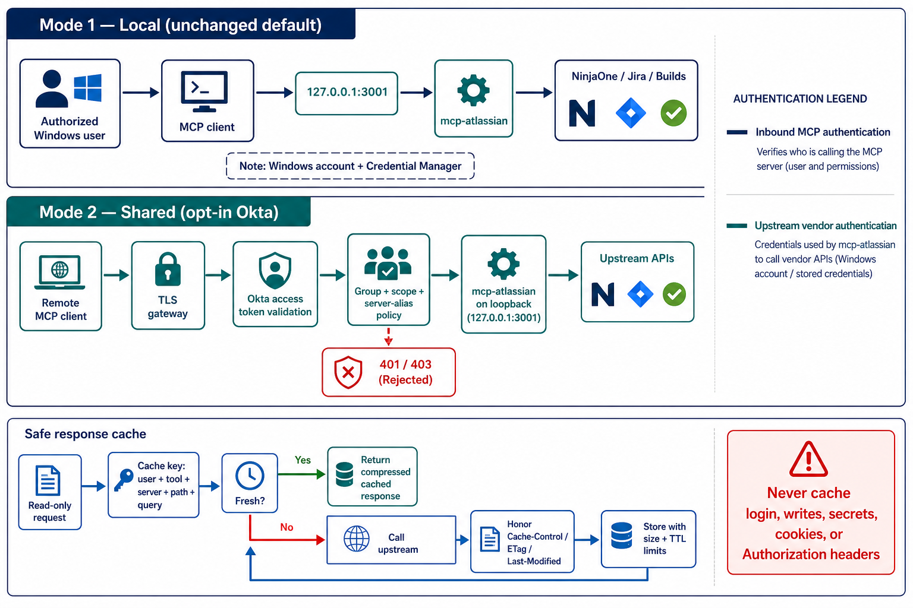

# Optional Okta authorization and response-cache design

Status: response-cache phase 1 implemented; Okta authorization and conditional validator revalidation remain proposed.



## Goals

1. Keep today's local, per-Windows-user deployment unchanged by default.
2. Add an explicitly enabled shared deployment protected by Okta access tokens.
3. Restrict authenticated callers to approved MCP tools and NinjaOne server aliases.
4. Reduce repeated upstream reads without returning one user's data to another user or serving stale data indefinitely.

## Two independent authentication boundaries

Inbound MCP authentication answers **who may call this MCP server**. In shared mode, an Okta access token supplies that identity and its groups/scopes.

Upstream vendor authentication answers **which identity mcp-devtools uses to call NinjaOne, Jira, or another vendor**. Those credentials remain server-held configuration or OS-keychain entries. An Okta login to the MCP server must never be treated as a NinjaOne session.

## Mode 1: unchanged local default

With no new authentication setting, behavior remains unchanged:

- bind only to `127.0.0.1`;
- accept local MCP requests without an HTTP bearer token;
- run one process under the authorized Windows account;
- resolve secrets from that account's Credential Manager;
- never expose port 3001 directly to another host.

Suggested default:

```text
MCP_AUTH_MODE=off
```

## Mode 2: opt-in Okta protection

An administrator explicitly enables shared mode:

```text
MCP_AUTH_MODE=okta
MCP_OKTA_ISSUER=https://example.okta.com/oauth2/default
MCP_OKTA_AUDIENCE=api://mcp-devtools
MCP_OKTA_REQUIRED_SCOPE=mcp:ninjaone
MCP_OKTA_REQUIRED_GROUP=MCP-NinjaOne-Users
```

The public endpoint should be TLS-only and sit behind a gateway. The Rust service can remain on loopback. Every `/mcp` request must carry an Okta **access token**, not an ID token or browser session cookie.

The server or trusted gateway must validate:

- JWT signature against the issuer's JWKS;
- exact issuer (`iss`);
- intended MCP audience (`aud`);
- expiry (`exp`) and not-before (`nbf`), with a small clock-skew allowance;
- required scope;
- required Okta group.

Invalid or expired authentication returns `401`. A valid identity lacking the required scope, group, tool, or server-alias permission returns `403`. Tokens and authorization headers must never be logged.

### Tool and NinjaOne server authorization

Authentication alone is insufficient because a caller could select any configured `NINJAONE_SERVERS` alias. Authorization should map Okta groups to permitted tools and aliases, for example:

```json
{
  "MCP-NinjaOne-Dev": {
    "tools": ["ninjaone_get", "ninjaone_login"],
    "servers": ["dev-*"]
  },
  "MCP-NinjaOne-QA": {
    "tools": ["ninjaone_get", "ninjaone_login"],
    "servers": ["qa*"]
  },
  "MCP-NinjaOne-Prod-Read": {
    "tools": ["ninjaone_get"],
    "servers": ["prod-*"]
  }
}
```

Policy evaluation occurs before tool dispatch. Default-deny applies when Okta mode is enabled. Audit records should contain subject ID, groups used for the decision, tool, server alias, decision, and correlation ID—but no request secrets or complete response bodies.

### Session isolation in shared mode

The existing NinjaOne cache is keyed by `(base URL including prefix, NinjaOne account email)`. That safely separates configured upstream accounts, but it does not separate two MCP callers who intentionally use the same upstream account.

If shared callers must have distinct NinjaOne sessions, extend the key to:

```text
(Okta subject, base URL including prefix, NinjaOne account email)
```

If the intended model is a shared service account, retaining one upstream session per server/account is acceptable, provided the Okta policy authorizes every caller to act as that service account and audit logs preserve the caller's Okta subject.

## Token and session expiration

Okta access tokens **do expire**. Validate `exp` on every request. Cached signature keys (JWKS) may be reused, but cached authorization decisions must never outlive the token's `exp` or a short policy TTL.

The observed NinjaOne MFA response contained `maxAge: -1`. That does not guarantee the session never expires; it only provides no finite client-side deadline. Continue using the session until NinjaOne returns `401` / `SESSION_KEY_EXPIRED`, then evict only that server/account session and require login again. If a future response supplies a positive lifetime, the cache may proactively expire slightly before that deadline.

## Safe upstream response caching

Phase 1 is implemented in the shared Rust HTTP transport and therefore covers every HTTP-backed vendor. It is opt-in, caches successful bodyless GETs, honors `no-store`, `no-cache`, `max-age`, `Expires`, and `Vary: *`, isolates entries by resolved credential fingerprint, invalidates a vendor/base namespace on writes, bounds entries/bytes, and compresses sufficiently large bodies with zstd. ETag/Last-Modified conditional revalidation and authenticated Okta-subject cache partitioning remain future phases.

Response caching should be a separate, opt-in feature. Start with read-only requests only and a default-deny endpoint policy.

### Eligibility

Cache only when all are true:

- MCP tool is read-only;
- upstream HTTP method is `GET` or another explicitly allowlisted safe read;
- response succeeded;
- response does not set `Cache-Control: no-store`;
- endpoint is not classified as sensitive or session-bearing;
- response fits configured size limits.

Never cache:

- `ninjaone_login` or any authentication endpoint;
- authentication responses other than the explicit NinjaOne session-properties exception below;
- POST, PUT, PATCH, or DELETE results by default;
- request/response headers containing cookies or authorization;
- passwords, MFA codes, tokens, session keys, raw build logs containing secrets, or error responses with credential details.

NinjaOne exception: after a successful `ninjaone_login`, the server immediately fetches `/webapp/sessionproperties` to validate the session and warm an identity-scoped in-memory entry when response caching is enabled. This response contains division/user context needed by later console and database-discovery workflows. Its cache key includes the session credential fingerprint, it is never persisted to disk by the cache, and `connect.authUser` remains redacted from debug logs.

### Cache identity

The minimum safe cache key in local mode is:

```text
(vendor, configured credential identity, server/base URL, method, normalized path, canonical query, body hash when explicitly allowed, representation/filter)
```

In Okta shared mode, include the authenticated Okta subject unless the endpoint is explicitly proven safe to share across the authorized group:

```text
(Okta subject, groups/policy version, vendor identity, server, method, path, query, representation)
```

Including `jq` and output format avoids returning a representation generated for a different request. Cache keys must use hashes for sensitive or lengthy components and must not reveal credentials in diagnostics.

### HTTP cache hints

Honor upstream hints when present:

- `Cache-Control: no-store` — never store;
- `Cache-Control: private` — store only in a caller-scoped cache;
- `Cache-Control: max-age=N` or `Expires` — cap the local TTL at the advertised lifetime;
- `ETag` — revalidate stale entries with `If-None-Match`;
- `Last-Modified` — revalidate with `If-Modified-Since` when no ETag exists;
- `Vary` — either incorporate the named request headers into the key or decline to cache.

Many APIs omit useful cache headers. In that case use short endpoint-specific TTLs, never an unlimited default. Starting suggestions—not promises of freshness—are:

- build/job status while running: 5–15 seconds;
- completed build summary: 2–10 minutes, preferably ETag-revalidated;
- Jira issue: 15–60 seconds;
- Jira metadata, project, field, or workflow definitions: 5–30 minutes;
- static reference lists: up to 1 hour when safe;
- unknown endpoint: no cache until allowlisted.

Writes should invalidate the affected vendor/server namespace or known resource keys. Because generic tools accept arbitrary paths, exact dependency invalidation is not always possible; conservative namespace invalidation is safer.

## Bounded and compressed in-memory storage

Do not retain an unbounded “old cache.” Use a weighted LRU/TinyLFU-style cache with both limits:

- maximum total uncompressed-equivalent bytes;
- maximum entry count.

Suggested lifecycle:

1. Keep new/hot small JSON entries uncompressed for low latency.
2. After an entry cools, compress bodies above a threshold (for example 8–16 KiB) with zstd at a low level.
3. Retain metadata uncompressed: key hash, owner/scope, timestamps, status, content type, validators, compressed and original sizes.
4. Evict expired entries first, then least-recently-used entries until both limits are satisfied.
5. Reject a single response larger than a configured fraction of total capacity.
6. Zeroize or drop sensitive buffers promptly; sensitivity classification happens before storage.

Compression saves memory for repetitive JSON and logs but costs CPU. Record hit rate, bytes saved, compression/decompression time, evictions, revalidations, and stale misses without logging cached content.

## Suggested implementation phases

1. Add optional Okta authentication with default-off behavior and tests proving local mode is unchanged.
2. Add default-deny group/scope/tool/server-alias authorization.
3. Propagate the authenticated subject into request context and audit events.
4. Add a small GET-only cache framework with strict exclusions, identity-aware keys, byte/entry bounds, and metrics.
5. Add HTTP validator support (`ETag`, `Last-Modified`) and endpoint-specific policies.
6. Add cold-entry compression only after measuring memory use and hit rate.

Each phase should ship independently. Authentication and authorization should not depend on caching, and disabling the cache must not affect request correctness.
